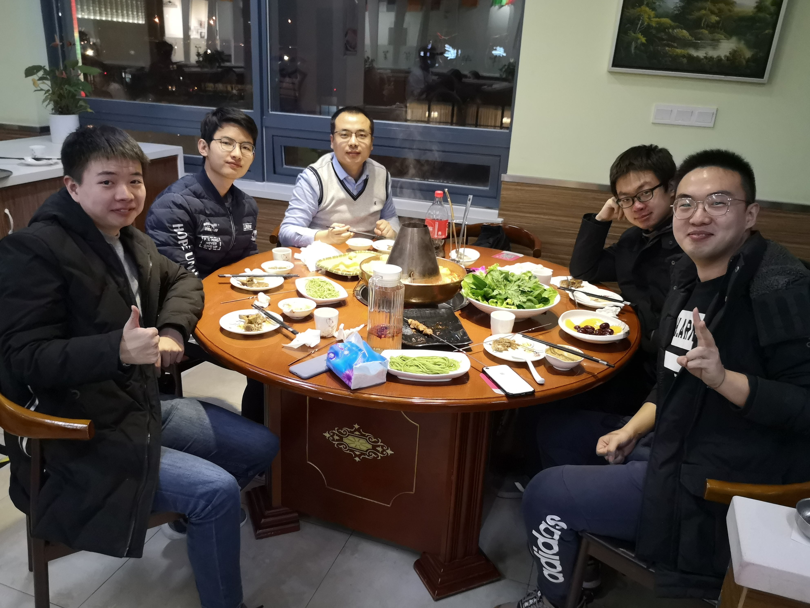

The Dinner Party of Toast Lab for the New Year of 2021
 

<h2><a name="/people/faculty">Faculty</a></h2>

<a href="https://sites.google.com/view/wangc/" style="text-decoration: none;" target="_blank"><strong>Chundong Wang</strong></a> (&#29579;&#26149;&#19996;) is the director of Toast Lab. He graduated with a bachelor's degree from <a href="http://www.xjtu.edu.cn/" style="text-decoration: none;" target="_blank">Xi'an Jiaotong University</a> at Xi'an, Shaanxi, China in July 2008. In November 2013, Chundong obtained the doctoral degree in <a href="https://www.comp.nus.edu.sg/" style="text-decoration: none;" target="_blank">School of Computing</a> of <a href="http://www.nus.edu.sg/" style="text-decoration: none;" target="_blank">National University of Singapore</a>. His supervisor is Associate Professor <a href="https://www.comp.nus.edu.sg/~wongwf/" style="text-decoration: none;" target="_blank">Weng-Fai Wong</a>.

From April 2014 to November 2017, Chundong worked as a Scientist in Data Storage Institute <a href="https://web.archive.org/web/20180612135951/https://www.a-star.edu.sg/News-and-Events/News/Press-Releases/ID/5940" style="text-decoration: none;" target="_blank">which has no longer functioned as an independent research unit since June 2018</a>. Then Chundong worked in the <a href="https://asset-group.github.io/" style="text-decoration: none;" target="_blank">ASSET Group</a> of <a href="https://www.sutd.edu.sg/" style="text-decoration: none;" target="_blank">Singapore University of Technology and Design</a> as a Research Fellow II. He has joined <a href="http://sist.shanghaitech.edu.cn/" style="text-decoration: none;" target="_blank">School of Information Science and Technology</a> of <a href="http://www.shanghaitech.edu.cn/" style="text-decoration: none;" target="_blank">ShanghaiTech University</a>, Shanghai, China as a tenure-track Assistant Professor in April 2020.

<h2><a name="/people/students">Students</a></h2>

<strong>Chongnan Ye</strong> (&#21494;&#23815;&#21335;), majoring in Computer Science at ShanghaiTech University from 2016 to 2020, has joined Toast Lab for the final year project of undergraduate programme and Master's degree in 2020. His research interests are on the fundamental concepts of computing, data management and analytics.

<strong>Qisheng Jiang</strong> (&#23004;&#20854;&#21319;), who received a bachelor's degree from Tongji University, will start the graduate program at ShanghaiTech University in 2021. His research interests include computer architecture, persistent memory, and key-value storage.

