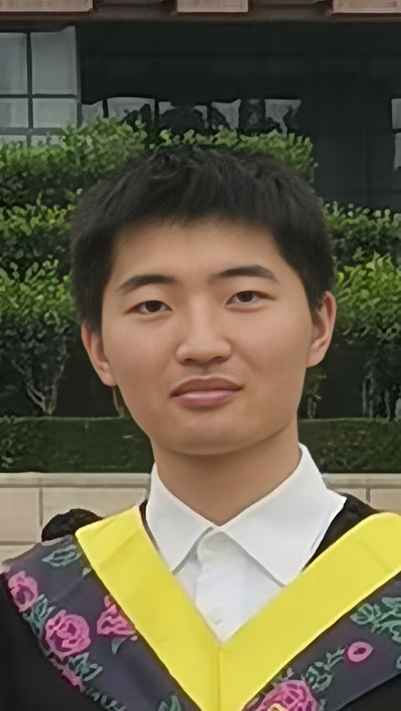

A Snapshot of Toast Lab Taken in December 2021
 

<h2><a name="/people/faculty">Faculty</a></h2>

<a href="https://chundong.wang/" style="text-decoration: none;" target="_blank"><strong>Chundong Wang</strong></a> (&#29579;&#26149;&#19996;) is the director of Toast Lab. He is also co-director of <a href="https://ssc.sist.shanghaitech.edu.cn" style="text-decoration: none;" target="_blank">Systems and Security Center</a> of ShanghaiTech. He graduated with a bachelor's degree from <a href="http://www.xjtu.edu.cn/" style="text-decoration: none;" target="_blank">Xi'an Jiaotong University</a> (&#35199;&#23433;&#20132;&#36890;&#22823;&#23398;) at Xi'an, Shaanxi, China in July 2008. In November 2013, Chundong obtained the doctoral degree in <a href="https://www.comp.nus.edu.sg/" style="text-decoration: none;" target="_blank">School of Computing</a> of <a href="https://www.nus.edu.sg/" style="text-decoration: none;" target="_blank">National University of Singapore</a> (&#26032;&#21152;&#22369;&#22269;&#31435;&#22823;&#23398;). His supervisor is Associate Professor <a href="https://www.comp.nus.edu.sg/~wongwf/" style="text-decoration: none;" target="_blank">Weng-Fai Wong</a>.

From April 2014 to November 2017, Chundong worked as a Scientist in Data Storage Institute, A&#42;STAR (&#26032;&#21152;&#22369;&#31185;&#25216;&#30740;&#31350;&#23616;&#25968;&#25454;&#23384;&#20648;&#30740;&#31350;&#38498;) <a href="https://web.archive.org/web/20180612135951/https://www.a-star.edu.sg/News-and-Events/News/Press-Releases/ID/5940" style="text-decoration: none;" target="_blank">which has no longer functioned as an independent research unit since June 2018</a>. Then Chundong worked in the <a href="https://asset-group.github.io/" style="text-decoration: none;" target="_blank">ASSET Group</a> of <a href="https://www.sutd.edu.sg/" style="text-decoration: none;" target="_blank">Singapore University of Technology and Design</a> (&#26032;&#21152;&#22369;&#31185;&#25216;&#35774;&#35745;&#22823;&#23398;) as a Research Fellow II. He has joined <a href="https://sist.shanghaitech.edu.cn/" style="text-decoration: none;" target="_blank">School of Information Science and Technology</a> of <a href="https://www.shanghaitech.edu.cn/" style="text-decoration: none;" target="_blank">ShanghaiTech University</a> (&#19978;&#28023;&#31185;&#25216;&#22823;&#23398;), Shanghai, China as a tenure-track Assistant Professor in April 2020.

<h2><a name="/people/students">Students</a></h2>

<!--

<strong>Chongnan Ye</strong> (&#21494;&#23815;&#21335;), majoring in Computer Science at ShanghaiTech University from 2016 to 2020, has joined Toast Lab for the final year project of undergraduate programme and Master's degree in 2020. His research interests are on the fundamental concepts of computing, data management and analytics.

-->

<!--

<strong>Qisheng Jiang</strong> (&#23004;&#20854;&#21319;), who received a bachelor's degree from Tongji University (&#x540c;&#x6d4e;&#x5927;&#x5b66;), will start the graduate program at ShanghaiTech University in 2021. His research interests include computer architecture, persistent memory, and key-value store.

-->

<!--

<strong>Qing Xu</strong> (&#x8bb8;&#x6674;) obtained her B.Eng. degree from Hunan Normal University (&#x6e56;&#x5357;&#x5e08;&#x8303;&#x5927;&#x5b66;). She would join Toast Lab for postgraduate study in 2021. Her research interests include file systems and persistent memory.

-->

<strong>Yanpeng Hu</strong> (&#32993;&#23721;&#40527;) graduated from ShanghaiTech University, majoring in Computer Science. He would join Toast Lab for postgraduate study in 2021. His research interests include NoSQL database, filesystem and NVM. 

<strong>Meng Chen</strong> (&#38472;&#28635;) is a postgraduate student majoring in computer science in the TOAST lab at ShanghaiTech University. He received his bachelor's degree from ShanghaiTech in 2022. His research interest lies in comouter systems, especially in systematic simulation and storage system.

<strong>Lei Jia</strong> (&#36158;&#30922;) graduated from ShanghaiTech University in 2022 with a Bachelor's degree in Computer Science. He would join Toast Lab for postgraduate study. His research interests include computer architecture, filesystem and NoSQL database.

<strong>Li Zhu</strong> (&#26417;&#33673;) graduated from Shanghaitech University in 2023 with a bachelor's degree in Computer Science. She has joined Toast Lab for postgraduate study. Her research interests include SQL and NoSQL database.

<strong>Junqi Mao</strong> (&#27611;&#20426;&#29738;), who received a bachelor's degree from Zhejiang University (&#27993;&#27743;&#22823;&#23398;), will start the graduate program at ShanghaiTech University in 2023. His research interests include computer architecture and Artificial Intelligence.

<strong>Yunxin Yang</strong> (&#26472;&#26112;&#26133;), who received a bachelor's degree from Harbin Institute of Technology (Shenzhen) (&#21704;&#23572;&#28392;&#24037;&#19994;&#22823;&#23398;(&#28145;&#22323;)), will start the graduate program at ShanghaiTech University in 2023. His research interests include key-value store, file system and database.  

<strong>Hanjia Cui</strong> (&#23828;&#21547;&#20339;) graduated from Shanghaitech University in 2024 with a Bachelor's degree in Computer Science. She has joined Toast Lab for postgraduate study. Her research interests include persistent memory, computer architecture and storage system.

<strong>Kunchang Guo</strong> (&#37101;&#22372;&#26124;) graduated from Nankai University (&#21335;&#24320;&#22823;&#23398;) with a B.Eng. degree and will join Toast Lab for postgraduate study in 2024. His research interests include computer architecture and storage system. 

<h2><a name="/people/alumni">Alumni</a></h2>

<strong>Juncheng Chu</strong> (&#20648;&#21531;&#25104;), M.Eng. 2024, ByteDance (&#23383;&#33410;&#36339;&#21160;).

<strong>Qing Xu</strong> (&#35768;&#26228;), M.Eng. 2024, Shanghai APACTRON Particle Equipment Co., Ltd (&#19978;&#28023;&#33406;&#26222;&#24378;&#31890;&#23376;&#35774;&#22791;&#26377;&#38480;&#20844;&#21496;).

<strong>Qisheng Jiang</strong> (&#23004;&#20854;&#21319;), M.Eng. 2024, Duke University (&#26460;&#20811;&#22823;&#23398;) for PhD program.

<strong>Xinyi Wu</strong> (&#21556;&#24515;&#24609;), M.Eng. 2024, Lingxi Games (&#28789;&#29312;&#20114;&#23089;).

<strong>Chongnan Ye</strong> (&#21494;&#23815;&#21335;), M.Eng. 2023, Biren Technology (&#22721;&#20190;&#31185;&#25216;).

<strong>Haoran Dang</strong> (&#x515a;&#x6d69;&#x7136;), B.Eng. 2022, ICT, CAS (&#x4e2d;&#x79d1;&#x9662;&#x8ba1;&#x7b97;&#x6240;) for postgraduate study.

<strong>Rui Wang</strong> (&#x6c6a;&#x9510;), B.Eng. 2021, Tokyo Tech (&#x6771;&#x4eac;&#x5de5;&#x696d;&#x5927;&#x5b66;) for postgraduate study.

