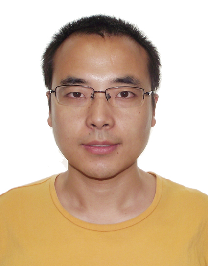

<h2><a name="/people/faculty">Faculty</a></h2>

<strong>Chundong Wang</strong> graduated with a bachelor's degree from <a href="http://www.xjtu.edu.cn/" style="text-decoration: none;" target="_blank">Xi'an Jiaotong University</a> in Xi'an, Shaanxi, China in July 2008. In November 2013, he obtained the doctoral degree in <a href="https://www.comp.nus.edu.sg/" style="text-decoration: none;" target="_blank"> the School of Computing</a> of <a href="http://www.nus.edu.sg/" style="text-decoration: none;" target="_blank">the National University of Singapore</a>, Singapore. His supervisor is Associate Professor <a href="https://www.comp.nus.edu.sg/~wongwf/" style="text-decoration: none;" target="_blank">Weng-Fai Wong</a>.

Currently Chundong works in the <a href="https://asset-group.github.io/" style="text-decoration: none;" target="_blank">ASSET Group</a> of <a href="https://www.sutd.edu.sg/" style="text-decoration: none;" target="_blank">Singapore University of Technology and Design</a>, Singapore as a Research Fellow II. He is going to join <a href="http://sist.shanghaitech.edu.cn/" style="text-decoration: none;" target="_blank">the School of Information Science and Technology</a> of <a href="http://www.shanghaitech.edu.cn/" style="text-decoration: none;" target="_blank">ShanghaiTech University</a>, Shanghai, China as a tenure-track Assistant Professor in Feburary 2020. He will be the director of Toast Lab.

<h2><a name="/people/students">Students</a></h2>
To be filled soon.

